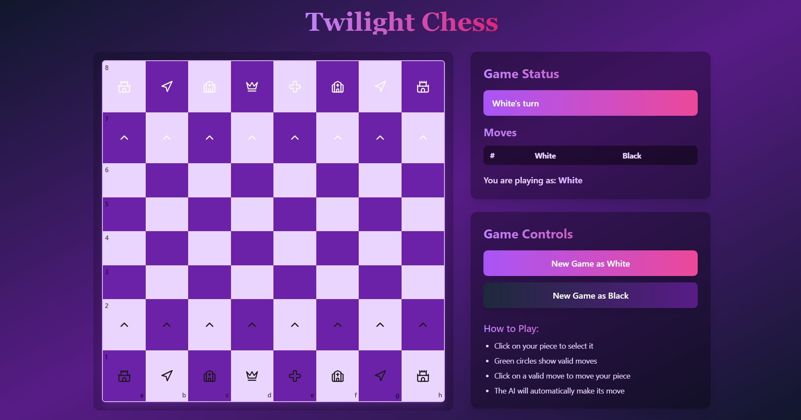

# Twilight Chess

## Welcome to Twilight Chess!

Twilight Chess is a simple web-based chess game where you can play against an AI opponent. Challenge yourself and see if you can outsmart the computer!

## Currently Hosted at:
[https://bejewelled-lamington-d7ea7f.netlify.app/](https://bejewelled-lamington-d7ea7f.netlify.app/)

## Gameplay

The game features a standard 8x8 chessboard. The objective is, as in traditional chess, to checkmate the opponent's king.

*(Above is a screenshot illustrating the game interface)*

## Interface Overview

* **Chessboard:** The main area displaying the 8x8 board with pieces.
* **Game Status:** Indicates whose turn it is (e.g., "White's turn").
* **Moves:** A numbered list tracking the moves made by both White and Black.
* **You are playing as:** Shows whether you are currently controlling the White or Black pieces.
* **Game Controls:** Buttons to start a "New Game as White" or "New Game as Black".
* **How to Play:** Simple instructions on interacting with the game.

## How to Play

1.  **Select your piece:** Click on the chess piece you wish to move.
2.  **View valid moves:** Green circles will appear on the board indicating the possible legal moves for the selected piece.
3.  **Make your move:** Click on one of the green circles to move your piece to that square.
4.  **AI's turn:** After you make your move, the AI will automatically calculate and make its move if it's its turn.

## Getting Started

Simply open the website in your web browser and the game should load automatically. Choose to play as White or Black to start a new game.

Enjoy playing Twilight Chess!
